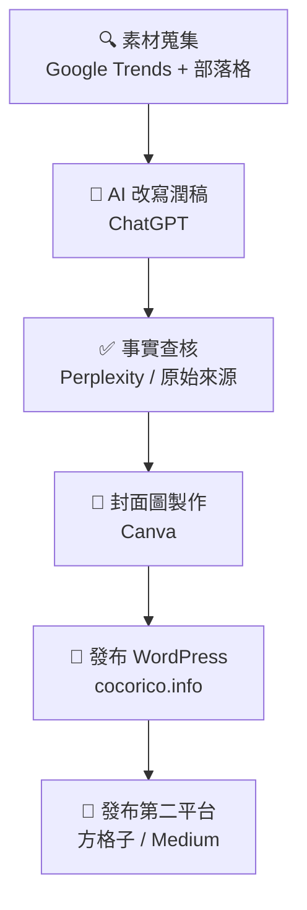

# Pipeline 說明

## 流程概述
本專題採用「AI 輔助內容產製」流程，從素材蒐集到多平台發布共分為六個階段。

## Mermaid 流程圖

## 各階段說明

### 第一階段：素材蒐集
- 工具：Google Trends、部落格、新聞網站
- 動作：搜尋台韓戲劇相關討論，找到具有觀點的素材文章
- 產出：原始素材文字

### 第二階段：AI 改寫潤稿
- 工具：ChatGPT
- 動作：將素材輸入 ChatGPT，指定主題方向、字數與語氣，產出初稿
- Prompt 方向：「請以台韓戲劇文化差異為主題，改寫以下素材，保留核心論點，語氣中立分析，繁體中文，約 1000 字」
- 產出：AI 生成初稿

### 第三階段：事實查核
- 工具：Perplexity、Wikipedia、原始新聞來源
- 動作：逐一核查文章中的數據與事實（如收視率、播出年份等）
- 產出：fact-check.md 紀錄

### 第四階段：封面圖製作
- 工具：Canva
- 動作：製作符合 WordPress 尺寸（1200×630px）的封面圖
- 產出：封面圖 JPG 檔

### 第五階段：發布 WordPress
- 平台：cocorico.info
- 動作：
  1. 貼上文章內容
  2. 設定分類（影視評論）
  3. 加上標籤（台劇、韓劇、偶像劇、OTT）
  4. 上傳封面圖
  5. 填寫 SEO meta（Yoast：標題、描述、關鍵字）
- 產出：已發布文章 URL

### 第六階段：發布第二平台
- 平台：方格子（vocus.cc）或 Medium
- 動作：將同一篇文章貼上第二平台，加上封面圖
- 產出：第二平台文章 URL 或截圖

## 時間估算
| 階段 | 估計時間 |
|------|----------|
| 素材蒐集 | 30 分鐘 |
| AI 改寫 | 15 分鐘 |
| 事實查核 | 30 分鐘 |
| 封面圖製作 | 20 分鐘 |
| WordPress 發布 | 20 分鐘 |
| 第二平台發布 | 10 分鐘 |
| **總計** | **約 2 小時** |
